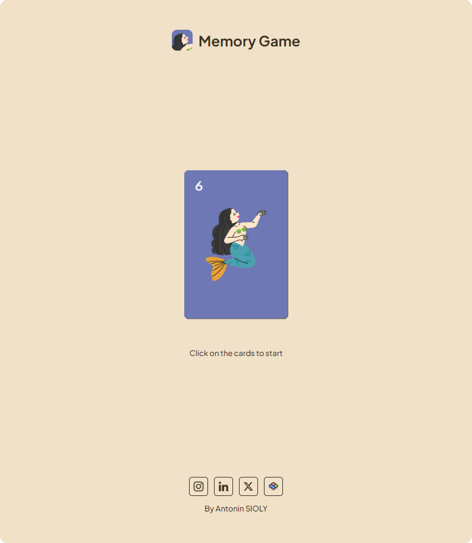

# Memory Game


## Overview
This project is a classic memory card game built with HTML, CSS, and JavaScript. The game features a simple user interface where players match pairs of cards by flipping them over. The objective is to find all matching pairs with the fewest moves and in the shortest time possible.

## Features
* **Responsive Design:** The game is fully responsive and works across various screen sizes.

* **Smooth Animations:** Cards flip with a smooth 3D rotation effect.

* **Game Timer:** A timer tracks how long it takes to complete the game.

* **Move Counter:** A counter tracks the number of moves the player makes.

* **Endgame Summary:** After all pairs are matched, a summary displays the total time and moves taken.

## Demo
Check out the live demo: [Memory Game Live](https://heyanto.github.io/Memory-Game/)


## Installation
1. Clone the repository:
```bash
git clone https://github.com/HeyAnto/Memory-Game.git
```
2. Navigate to the project directory:
```bash
cd Memory-Game
```
3. Open "index.html" in your favorite web browser.

## Technologies Used
* **HTML5:** For structuring the game layout.

* **CSS3:** For styling and adding 3D flip animations.

* **JavaScript (ES6):** For game logic, including shuffling cards, handling user interactions, and managing the game state.

## Learning Objectives
This project was created as part of my journey to become a web developer. By building this Memory Card Game, I aimed to:

* Enhance my understanding of HTML, CSS, and JavaScript.

* Practice DOM manipulation and event handling in JavaScript.

* Implement responsive design principles for a seamless user experience across devices.

* Gain experience in managing game state and user interactions.

I'm preparing to enter a formal web development training program in early 2025, and this project is a key step in my preparation.

## Contributing
If you would like to contribute to this project, please feel free to fork the repository and submit a pull request. Any feedback or suggestions are also welcome!